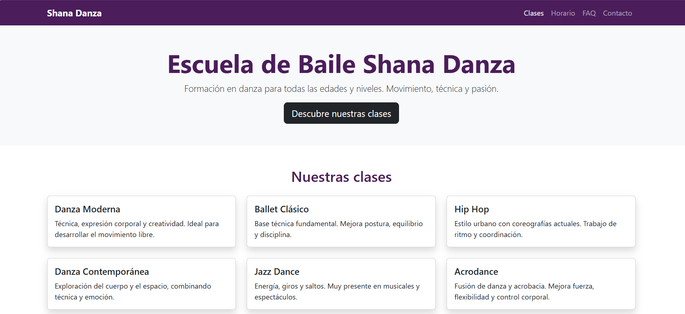
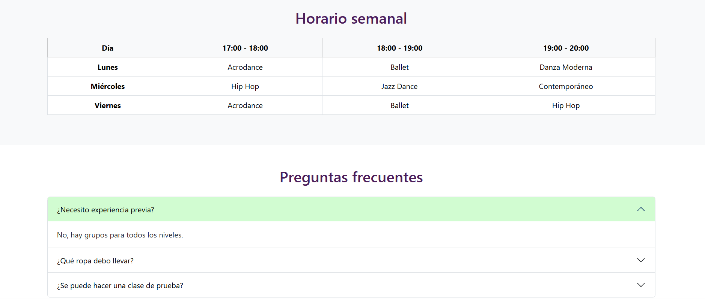
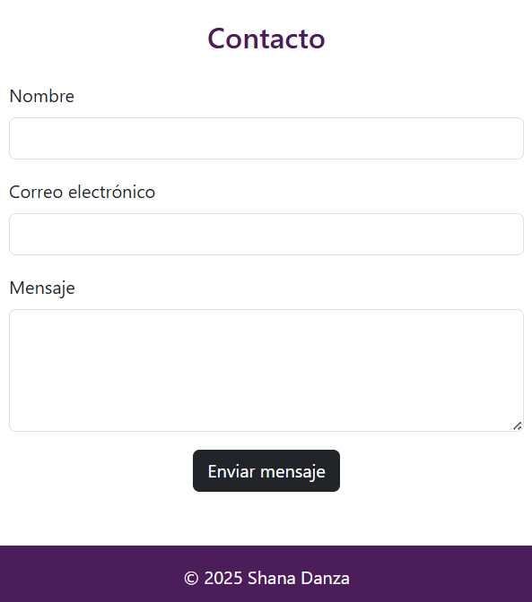

# Shana Danza - Proyecto Web

Este documento presenta el desarrollo de la página web para **Shana Danza**, una escuela de baile. El proyecto tiene como objetivo principal ofrecer una plataforma digital informativa, accesible y atractiva para comunicar los servicios y horarios de la escuela.

## 📄 Descripción del Proyecto

La página web funciona como una carta de presentación digital. Se ha diseñado pensando en la facilidad de uso, permitiendo a los visitantes encontrar rápidamente la información sobre las disciplinas de baile, la programación semanal y las vías de contacto.

## 🚀 Proceso de Trabajo

El desarrollo se ha llevado a cabo siguiendo estas fases:

1.  **Organización del Contenido**: Se estructuró la información de manera lógica (Inicio, Clases, Horario, Preguntas Frecuentes y Contacto) para asegurar una navegación fluida.
2.  **Diseño Visual**: Se utilizaron herramientas de diseño estandarizadas para garantizar una apariencia limpia, ordenada y moderna desde el primer momento.
3.  **Personalización de Marca**: Se aplicaron los colores corporativos (tonos morados y verdes) y estilos específicos para dotar al sitio de una identidad propia y diferenciada.
4.  **Adaptación a Dispositivos**: Se verificó y ajustó el diseño para asegurar que la visualización sea óptima tanto en pantallas grandes (ordenadores) como en dispositivos móviles.

## 💡 Enfoque del Desarrollo

Para la realización de este proyecto se tomaron las siguientes decisiones:

*   **Prioridad en la experiencia móvil**: Dado que muchos usuarios acceden desde sus teléfonos, se aseguró que elementos complejos, como la tabla de horarios, sean fáciles de leer en pantallas pequeñas.
*   **Simplicidad**: Se optó por mantener todo el código y los estilos integrados de manera eficiente, facilitando la gestión y carga de la página.
*   **Interactividad visual**: Se añadieron efectos sutiles al interactuar con los elementos (como al pasar el cursor sobre las opciones de clase) para hacer la navegación más dinámica y agradable.

## 📷 Galería de Imágenes

A continuación se muestra el resultado final del diseño en diferentes formatos:

### Vista de Escritorio

*La página presenta una estructura clara con un menú de navegación superior y secciones bien diferenciadas.*

### Vista Adaptada (Móvil)

| Inicio | Clases y Horario | Contacto |
| :---: | :---: | :---: |
|  |  |  |

*El diseño se ajusta verticalmente para facilitar la lectura y el uso en teléfonos inteligentes.*

---
**Realizado como parte de la Actividad de Repaso Final.**
